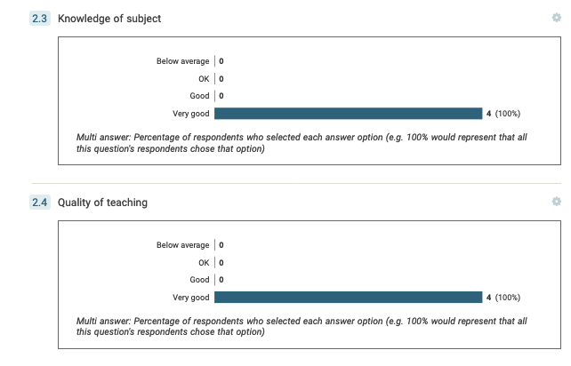

## Introducción
Empezaré este artículo siendo brutalmente honesto con todos. Ciencia de materiales fue uno de los cursos que pasé con menor nota durante el pregrado. Eso no significa que no me guste ni que no sepa nada, creo que mi baja nota fue el resultado de una mezcla de exámenes difíciles y conceptos no muy sencillos de digerir. Recuerdo que el profesor decía "creo que este curso deberia estar más adelante en la carrera".

En en el Departamento de Ciencias de Ingeniería ([Engineering Science Department](https://www.eng.ox.ac.uk/)) de la Universidad de Oxford, Ciencia de Materiales es un curso opcional para los estudiantes de tercer año. Es necesario aclarar por qué es opcional y cómo es el programa de Ingeniería en esta universidad.

En Oxford, solamente existe la carrera de Ingeniería "a secas". Así es, no hay grados de ingeniero industrial, o ingeniero civil, ni nada de eso. Todos, hasta el segundo año llevan los mismos cursos básicos como matemáticas, programación, etc etc. Es en el tercer año en que los estudiantes se especializan llevando cursos electivos dependiendo de sus intereses. Por ejemplo, alguien que quiere acercarse a la especialidad de ingeniería mecanica optará por llevar cursos de energía o de estructuras.

Este año académico, fui tutor del curso de Ciencia de Materiales y aprovecho que el año académico acaba de terminar para compartir mi experiencia.

El curso es, en general, es muy divertido. Hace mucho énfasis en aplicaciones y ejemplos prácticos que pueden ser utilizados en el diseño de componentes con diversos materiales. Se sacrifica un poco del tiempo dedicado a detalles microestructurales, para enfocarse más en aplicaciones, lo cual, para los ingenieros creo que va muy bien. También es muy intenso, dura apenas 8 semanas, 2 semanas (4 clases) por cada uno de los 4 módulos.

## Módulo 1: Metales
El curso que yo llevé en la carrera de Ingeniería Mecánica en la Universidad Nacional de Ingeniería, fue dedicado principalmente a metalurgia. Es por esto que la mayoría de temas de este módulo ya los había visto antes. Sin embargo me sorprendió que en 2 semanas cubran tanto contenido como lo que yo estudié en mucho más tiempo durante mis estudios en Perú.

## Módulo 2: Cerámicos
Dentro del curso, este es uno de los materiales que menos conocía, pero me sirvió mucho para aprender a analizar componentes cerámicos. Uno de los conceptos clave es que los materiales cerámicos son mucho más resistentes en compresión debido a que las microgrietas existentes tienden a cerrarse. Tambien se hace hincapié en análisis estadístico de fallas y a una introducción a la mecánica de la fractura.

## Módulo 3: Polímeros
Aquí los estudiantes estudian los conceptos básicos desde la estructura molecular y la termodinámica de polímeros, hasta sus propiedades viscoelásticas. El concepto de viscoelasticidad se aplica de forma práctica en la solución de problemas con modelos mecánicos los sistemas de Maxwell's y Kelvin-Voigt.

## Módulo 4: Compuestos
Fue genial que el último módulo del curso haya sido materiales compuestos, ya que el caso particular que se estudia es el material compuesto de fibras cerámicas embebidas en matrices poliméricas, justamente los materiales que se estudiaron en los módulos anteriores. La mecánica de materiales compuestos es cubierta solamente dentro del rango elástico del material. Se estudian relaciones analíticas que permiten deducir las propiedades elásticas del material en base a las propiedades de los constituyentes. Además se estudia el análisis de fallas y fractura dependiendo del estado de esfuerzos que se pueda encontrar, por ejemplo en una tubería o un tanque a presión.

##Respuesta de los estudiantes
Muy felizmente justo esta semana recibí un correo electrónico con los resultados de una encuesta sobre mi desempeño como tutor del curso. Obviamente fue muy motivador recibir tan buenas opiniones de parte de mis estudiantes (aunque solamente 4 de ellos participaron de la encuesta jeje).

De hecho, uno de los estudiantes escribió el siguiente comentario: *"Very good tutor: engaged and passionate about subject."*

No puedo esperar por mi próxima experiencia enseñando más cursos para ingeniería.
